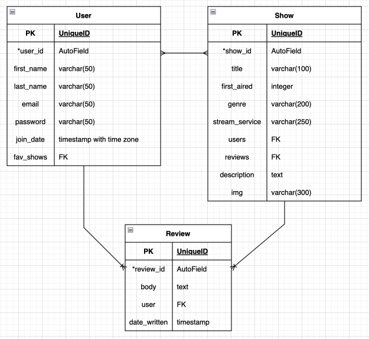

# Multimedia-Recs
A website for sharing movie and TV show recommendations with family and friends

## Project Description
Years ago I created a spreadsheet for my extended family to be able to share tv show recommendations, because we have similar (good) taste in multimedia. I plan on improving on that with this project, so that instead of just a massive list, each recommended show or movie can have multiple users endororsing it, and users can add a review as a bonus if they want to (just no spoilers). It will be much easier to see which show or movie you have missed out on and should be next on your list, because you'll be able to see exactly how many users have enjoyed it. Similarly, maybe you'll figure out your tastes align more with a specific other user, and you can browse their page to just see their individual list of recommendations, much like the employee recomendation shelves in the video rental stores of yesteryear. 

## Requirements
  - At least two data models and a user model
    - a one-to-many association (singular media to reviews)
    - a many-to-many association (multiple media to many users)
  - Data Validation
  - Error Handling
  - Home Page
  - Thoughtful and delightful design
    - Use framework or CSS, or both
  - Heroku deployment
  - 60+ commits
  - Useful README (boom, this right here, off to a good start)
  - Bonuses
    - Responsive Design for tablet or phone usage
    - Light mode / dark mode toggle

## Technologies Used
    - Django  
    - PostgreSQL   
    - Heroku
    - Miro and Draw.io for planning

## Deploy
[TBD]()

## Github
[https://github.com/mbahan1/Multimedia-Recs](https://github.com/mbahan1/Multimedia-Recs)

## Planning Docs
[User Research]()  
[User Stories]()  
[User Flow]()  
[ERD](Planning/ERD.png)  
[Color Pallet]()  
[Wireframes]  

## User Stories
AAU, I want to see a description of the website when I first visit.
AAU, I want to be able to login or create a new account to login.
AAU, I want to see a list of recommended media to watch.
AAU, I want to be able to click on a show title and see more information about it.
AAU, I want to add my own thumbs up to a listed show that I liked as well.
AAU, I want to be able to add a review to the show it I want.
AAU, I want to be able to edit or delete the review in case I change my mind or see a typo.
AAU, I want to add a new show to the list of recommended shows.
AAU, I want to browse other people profiles to see all of the shows they have given a thumbs up.
AAU, I want to logout so someone can't use my account and make it look like I have bad taste.

## ERD

## Wireframes

## Installation/scripts

## Sourced media

## Credits