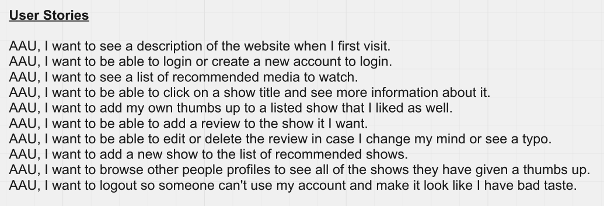
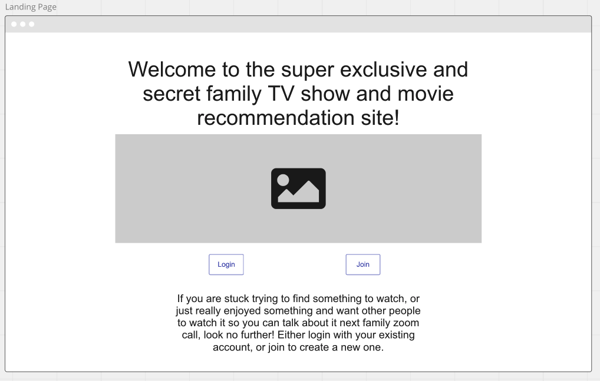
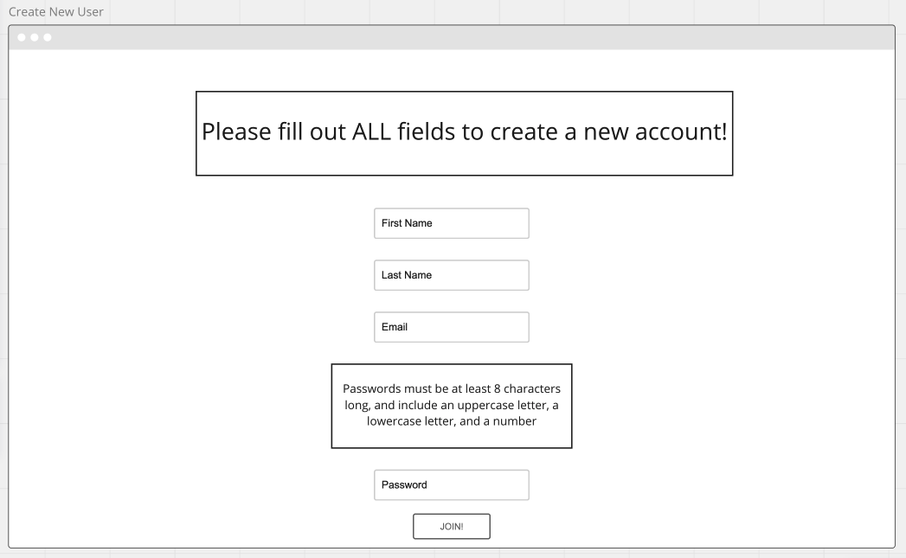
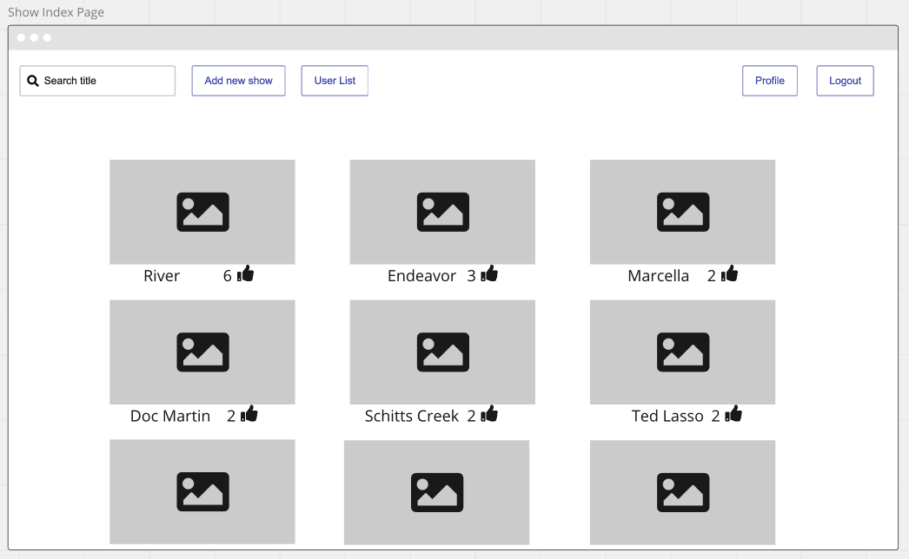
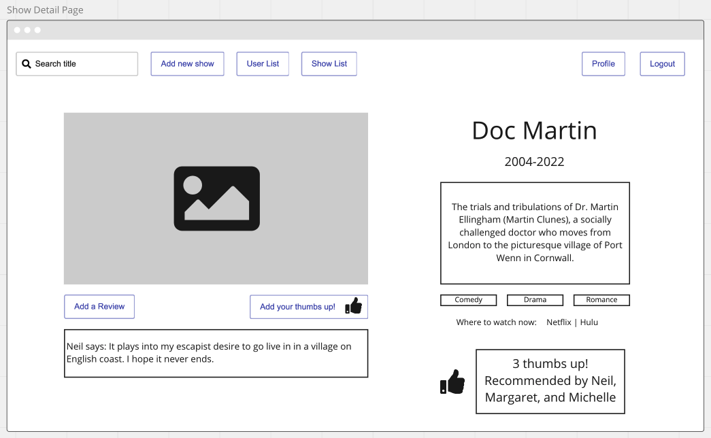
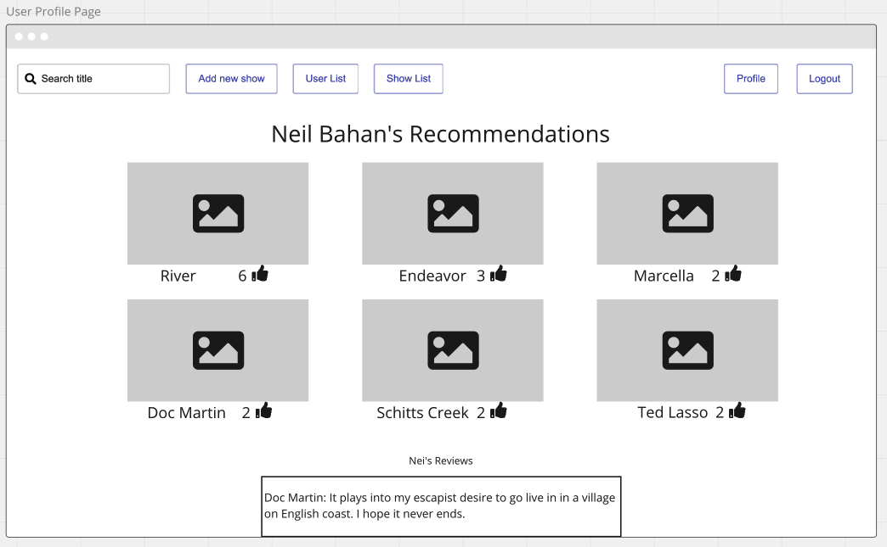
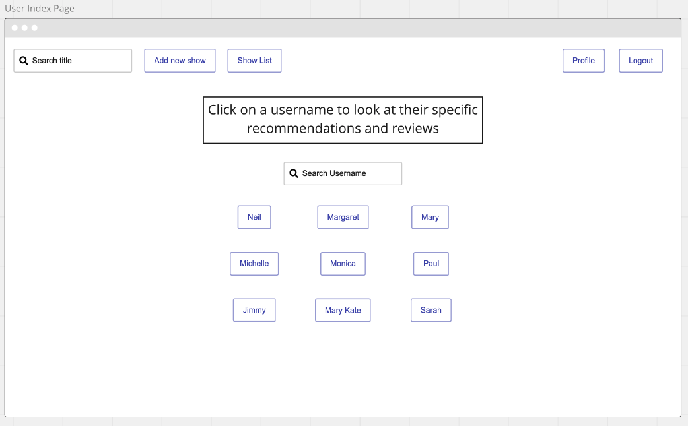

# Multimedia-Recs
A website for sharing movie and TV show recommendations with family and friends

## Table of Contents
[Project Description](##project_description)
[Project Requirements](##project_requirements)
[Technologies Used](##technologies_used)
[Deployment](##deployment)
[Github Repo](##github_repo)
[User Stories](##user-stories)  
[ERD](##erd)  
[Wireframes](##wireframes)  
[Color Pallet]()
[Installation/scripts](##installation/scripts)
[Sourced Media](##sourced_media)
[Credits](##credits)

## Credits

## Project Description
Years ago I created a spreadsheet for my extended family to be able to share tv show recommendations, because we have similar (good) taste in multimedia. I plan on improving on that with this project, so that instead of just a massive list, each recommended show or movie can have multiple users endororsing it, and users can add a review as a bonus if they want to (just no spoilers). It will be much easier to see which show or movie you have missed out on and should be next on your list, because you'll be able to see exactly how many users have enjoyed it. Similarly, maybe you'll figure out your tastes align more with a specific other user, and you can browse their page to just see their individual list of recommendations, much like the employee recomendation shelves in the video rental stores of yesteryear. 

## Project Requirements
  - At least two data models and a user model
    - a one-to-many association (singular media to reviews)
    - a many-to-many association (multiple media to many users)
  - Data Validation
  - Error Handling
  - Home Page
  - Thoughtful and delightful design
    - Use framework or CSS, or both
  - Heroku deployment
  - 60+ commits
  - Useful README (boom, this right here, off to a good start)
  - Bonuses
    - Responsive Design for tablet or phone usage
    - Light mode / dark mode toggle

## Technologies Used
    - Django  
    - PostgreSQL   
    - Heroku
    - Miro and Draw.io for planning

## Deployment
[TBD]()

## Github Repo
[https://github.com/mbahan1/Multimedia-Recs](https://github.com/mbahan1/Multimedia-Recs)

## User Stories

## ERD

## Wireframes

## Installation/scripts

## Sourced Media

## Credits