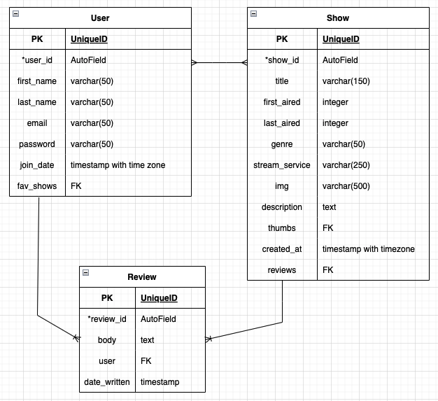

# Multimedia-Recs
A website for sharing movie and TV show recommendations with family and friends

## Table of Contents
[Project Description](#project-description)  
[Project Requirements](#project-requirements)  
[Technologies Used](#technologies-used)  
[Deployment](#deployment)  
[Github Repo](#github-repo)  
[User Stories](#user-stories)   
[ERD](#erd)  
[Wireframes](#wireframes)  
[Sourced Media](#sourced-media)  
[Credits](#credits)  

## Project Description
Years ago I created a spreadsheet for my extended family to be able to share tv show recommendations, because we have similar (good) taste in multimedia. I plan on improving on that with this project, so that instead of just a massive list, each recommended show can have multiple users endororsing it, and users can add a review as a bonus if they want to (just no spoilers). It will be much easier to see which show you have missed out on and should be next on your list, because you'll be able to see exactly how many users have enjoyed it. It's like broswing the employee recomendation shelves in the video rental stores of yesteryear. 

## Project Requirements
  - At least two data models and a user model
    - a one-to-many association (singular media to reviews)
    - a many-to-many association (multiple media to many users)
  - Data Validation
  - Error Handling
  - Home Page
  - Thoughtful and delightful design
    - Use framework or CSS, or both
  - Heroku deployment
  - 60+ commits
  - Useful README (boom, this right here, off to a good start)
  - Bonuses
    - Responsive Design for tablet or phone usage
    - Light mode / dark mode toggle

## Technologies Used
    - Django  
    - PostgreSQL 
    - Bootstrap  
    - Heroku
    - Miro and Draw.io for planning 

## Deployment
[https://two-thumbs-up.herokuapp.com/](https://two-thumbs-up.herokuapp.com/)

## Github Repo
[https://github.com/mbahan1/Multimedia-Recs](https://github.com/mbahan1/Multimedia-Recs)

## User Stories

## ERD

## Wireframes

## Sourced Media
Show information and descriptions taken from IMDB, photo sources list in DB, and streaming services for each show found using JustWatch.

## Credits
Thanks to the 1026 instructors for help when I hit roadblocks, and my family with great media taste and a lot of recommendations that have kept me entertained for hours, hopefully this will be more fun and easier to use than the massive spreadsheet.